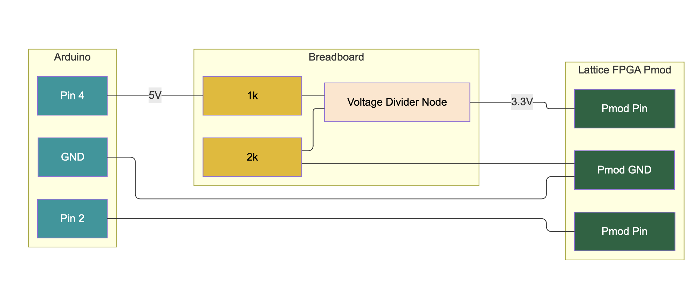

# UART connection between the Icestick and Elegoo Uno R3

This small project builds a UART module on the Icestick FPGA which receives and then transmits back signals to the Arduino.

The UART module is in `core/uart.v` and is a reproduction of [this source code](https://github.com/cyrozap/osdvu/blob/276dd06ee5c01fc49e522272ceef088a15af3fe5/uart.v). The core logic is adapted to the Icestick in the `uart_demo.v` file and can be uploaded with `apio`.

Importantly the Pmod connections on the Lattice Icestick are the 'wrong side up' when positioned as in the [user manual (downloads PDF)](http://www.latticesemi.com/view_document?document_id=50701).
Meaning the top two pins are both 3.3v, the bottom left is Pin 7 (PIO1_06) and the bottom right is Pin 1 (PIO1_02)

## Setting up the Arduino CLI

1. Install [Arduino CLI](https://arduino.github.io/arduino-cli/1.0/installation/) with brew
2. Plug in board and find it: `arduino-cli board list`
3. Navigate to, compile and upload the Arduino Code in `arduino-uart-receiver`
   
   ```
   arduino-cli compile --fqbn arduino:avr:uno --build-path build 

   arduino-cli upload -p /dev/tty.usbmodem1301 --fqbn arduino:avr:uno --input-dir build
   ```

## Layout of the connections

A level shifter is needed to reduce the 5v output signal from the Arduino to 3.3v. A pair of resistors achieves this on the breadboard. More info [here](https://randomnerdtutorials.com/how-to-level-shift-5v-to-3-3v/)



## See the output

You can see that it's working by:
- D1 LED flashing upon UART signal reception
- D4 LED flash when transmitting data back to the Arduino
- Arduino L LED flashes when receiving UART input

You can also read the serial output of both devices using `screen`. On a Mac:
- Find ports in use: `ls /dev/tty.*` and figure out which one is the Arduino and the Icestick
- Read the serial signal from the device: `screen /dev/tty. 9600`
- Should print: `Message #N`
